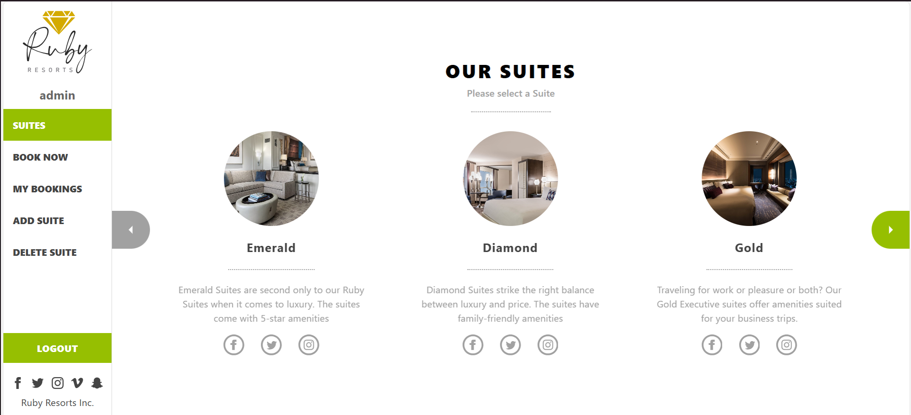
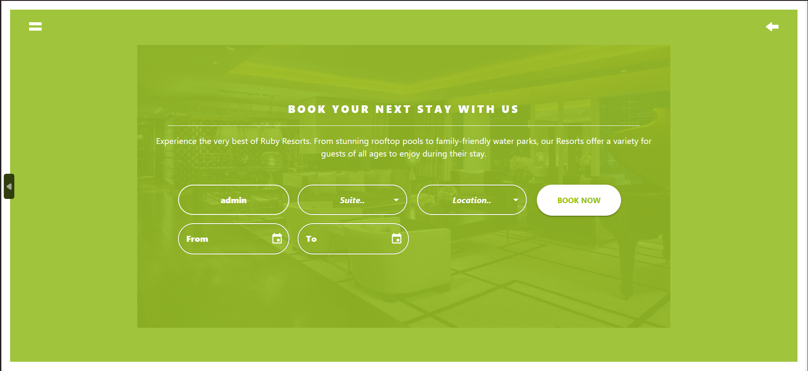
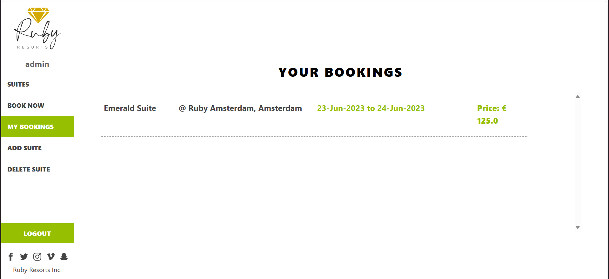
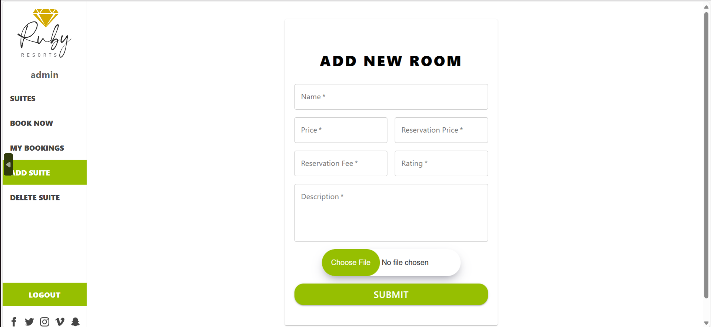
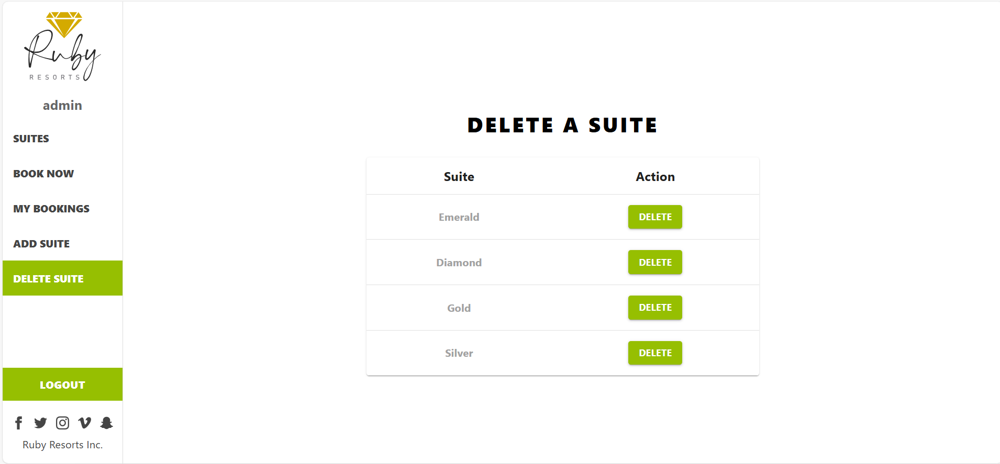

# SD-3101 Ruby Resorts Front end


</div>

## Table of Contents
- [Introduction](#introduction)
- [Project Overview](#project-overview)
- [Objectives](#objectives)
- [Features](#features)
- [Technologies Used](#technologies-used)
- [Setup and Installation](#setup-and-installation)
- [Usage Instructions](#usage-instructions)
- [Project Structure](#project-structure)
- [Contributors](#contributors)
- [Chagelog](#changelog)
- [Acknowledgments](#acknowledgments)
- [License](#license)

---

## Introduction
Introducing the Resort Reservation Management System (RRMS), which is intended to improve visitor experiences at our resort by expediting the booking process. Managing reservations, room availability, and guest preferences effectively and in real-time is the main goal of RRMS, guaranteeing each visitor a smooth and customized stay. The problems of overbooking, administrative inefficiencies, and disgruntled guests are addressed by RRMS, which optimizes resort operations and raises overall guest happiness by automating booking tasks, reducing human error, and offering immediate access to reservation details.

## Project Overview
Bookings, room allocations, and guest interactions are all automated by the Resort Reservation Management System (RRMS), which modernizes reservation procedures. RRMS, which is intended for use by resort management, front desk employees, and visitors, boosts operational effectiveness, lowers mistake rates, and raises guest happiness with real-time updates and customized services. In practice, it means more efficient operations, improved revenue control, and a smoother visitor experience, all of which increase resort profitability and performance.

## Objectives
State the main objectives of the capstone project, such as:
1. Develop a Solution for Reservation Management Challenges                                    
2. Implement Key Features to Achieve Operational Efficiency
3. Test and Validate System Performance

## Features
List the main features of the project:
- Suite: The resort offers a range of suites that guests can choose and select from. With the comprehensive information provided about each suite, users can choose the one that most interests them.
- Book now:  After choosing a suite, a user can reserve it by using the "Book Now" option. Customers will have the option to choose the suite of their dreams and provide the precise dates of their stay.
- My Bookings: Users can use this tool to view the specifics of their existing reservations, such as the suites they've booked and the dates of their stays.
- Add Suite: Users had an option to make it simple to reserve extra suites. They can easily make reservations for several suites at once.
- Delete Suite: The system permits cancellations through the "Delete Suite" option in the event that a user has to do so or changes their mind.
- Login/out: Users can check, edit, or cancel their reservations by logging in and accessing their account. By logging out, users may protect the confidentiality of their reservation information and avoid unwanted access to their account details.

## Technologies Used
Mention the tools, frameworks, and technologies used in the project:
- Programming Language: JavaScript
- Frameworks/Libraries: React.js, Redux Toolkit, RTK Query, MUI React UI, React Testing Library
- Databases: None specified for frontend
- Additional Tools: Create React App, Git (assumed for version control)

## Setup and Installation
Step-by-step instructions for setting up the project locally.

Clone this repository to your desired folder:

```sh
  cd <desired-folder>
  git clone https://github.com/thebadsektor/se2024-buenconsejo-bugayong.git
```

### Install

Install the project dependencies by running:

```sh
  npm install
```

The above command installs necessary npm modules used in the project

### Usage

To run the project, execute the following command:

```sh
  npm run start
```

The above command starts the devserver and renders the page in your browser.

### Run tests

To run tests, run the following command:

```sh
npm run test
```

We have added jest test cases for the components in the project. Mock store, mock server and test data can be found in `src/test-utils` folder. We have used Mock Service Worker to handle API requests in tests. 

### Deployment

You can deploy this project using:

```sh

npm run build

```
The above command creates build files that can be deployed using Github pages or any other hosting service.
**Note:** If your project has external depencies like XAMPP, MySQL, special SDK, or other environemnt setup, create another section for it.

## Usage Instructions
Provide detailed instructions on how to use the project after setup:
- How to access the application.

## Application's admin credentials for evaluation

Please use the following credentials for evaluation
  <br />
  username : admin
  <br />
  password : admin123
  
- Screenshots or GIFs showcasing key functionalities (optional).












- Example commands or API calls (if applicable).
  Here you can find the [Project API documentation](https://ruby-resorts-backend.onrender.com/api-docs/index.html)

### API Design

Here you can find the project's initial [API design](readme-res/API.md)

### Project ERD diagram


<br/>
  
## Project Structure
Explain the structure of the project directory. Example:
```bash
.
├─ public/
│  ├─ images/
│  ├─ favicon.ico
│  ├─ index.html
│  ├─ manifest.json
│  ├─ robots.txt
│  ├─ 
├─ readme-res/
│  ├─ API.md
│  ├─ app_logo.jpeg
│  ├─ app_logo.svg
│  ├─ erd_diagram_ruby_resort.png
│  ├─ kanbanbackend.png
│  ├─ kanbanfrontend.png
├─ src/
│  ├─ __tests__/
│  ├─ components/
│  ├─ redux/
│  ├─ services/
│  ├─ styles/
│  ├─ testutils/
│  ├─ utilities/
│  ├─ .babelrc
│  ├─ App.css
│  ├─ App.js
│  ├─ index.css
│  ├─ index.js
├─ Dockerfile
├─ .dockerignore
├─ README.md


```

## Contributors

List all the team members involved in the project. Include their roles and responsibilities:

- **Shemara Lei F. Bugayong**: Lead Developer, Backend Developer
- **Colyn Buenconsejo**: Frontend Developer, UI/UX Designer
- **Gerald Villaran**: Project Manager, Tester

## Project Timeline

Outline the project timeline, including milestones or deliverables. Example:

- **Week 1-2**: Collaborative Brainstorming For Feature Development.
- **08/17/24** : https://youtu.be/MGo5k7BQodU?si=znZuLenawhjMSMyw
- **Proposes Features**
  1. Separate Logins for Admin and Users
  2. Multiple Room Bookings
  3. Guest Reviews and Ratings
  4. Booking Summary Page
  5. Special Offers and Promos
  6. Booking Confirmation
  7. Calendar Booking View
  8. Customizable Stay Reminders
  9. Room Preference Notes
  10. Cancellation and Modification Options
 
   - Feature: Dockerize Project
   - Target Completion: 27/10/2024
    
- **Week 3-5**: Design and setup.
- **Week 6-10**: Implementation.
- **Week 11-12**: Testing and debugging.
- **Week 13-14**: Final presentation and documentation.

## Changelog

### [Version 1.0.0] - 2024-09-07
- Initial release of the project.
- Added basic functionality for [Feature 1], [Feature 2], and [Feature 3].

### [Version 1.1.0] - 2024-09-14
- Improved user interface for [Feature 1].
- Fixed bugs related to [Feature 2].
- Updated project documentation with setup instructions.
### [Version 1.2.0] - 2024-09-21
- Added new functionality for [Feature 4].
- Refactored codebase for better performance.
- Added unit tests for [Feature 3] and [Feature 4].


## Acknowledgments

Acknowledge any resources, mentors, or external tools that helped in completing the project.

This project was built from [Original Project Name](https://github.com/anthonymr/ruby-resorts-frontend.git), created by anthonymr Anthony Martin. You can view the original repository [here](https://github.com/anthonymr/ruby-resorts-frontend.git).

## License

Specify the project's license. For starters, adapt the license of the original repository.


